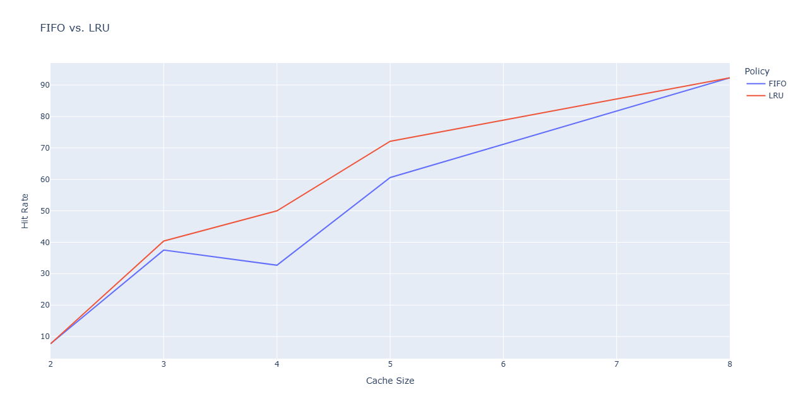

# Simple Cache Simulator

This project simulates CPU cache behavior and evaluates the effectiveness of different cache replacement policies. Given a memory access trace, the simulator tracks cache hits and misses, computes hit rates, and compares the performance of FIFO (First-In First-Out) and LRU (Least Recently Used) replacement strategies across varying cache sizes.

The project was built to explore fundamental computer architecture concepts such as temporal locality, cache efficiency, and replacement policy design.

## Features

- Configurable cache sizes
- FIFO replacement policy
- LRU replacement policy
- Memory trace file processing
- Hit/miss statistics
- Hit-rate analysis
- Data visualization using Pandas and Plotly
## Technologies/Logic Used

- Python 3.14.5
- Pandas
- Plotly
- Dictionaries
- Lists/queues

## How It Works

This simple cache simulator works by reading memory addresses from a trace file (`memory.txt`) and classifying each access as either a hit or miss. The cache updates according to both First In First Out policy or Least Recently Used policy, and resulting statistics are collected from both simulations and visualized with Pandas and Plotly.
## Results & Findings

By testing different cache sizes with both policies, I learned that there was a positive correlation between larger cache sizes and greater hit rates. This is due to the fact that the cache is able to store more memory addresses simultaneously, reducing the likelihood of a frequently accessed address is evicted before it is needed again. These results give me something to think about as there is a large tradeoff between hardware resource requirements and performance improvement.

I also noticed that LRU outperformed FIFO a significant amount. It has a higher hit rate because of its fundamental behavior to keep frequently reused data in the cache. This observation highlights why many modern systems use policies that consider recency rather than order of insertion.
## Challenges

In all honesty, I began this project with no understanding of cache whatsoever. I dealt with a very steep learning curve, but once I understood the fundamentals of cache, it was relatively simple to program a simulator. Additionally, while programming, I felt an undeniable connection from the logic used in this simulator to logic exercises I completed in my introduction to Python and Java classes. That familiarity propelled this project forward both logically and motivationally; it didn't felt as daunting as before.

Another challenge I dealt with was implementing efficient data structures. At first, I started with lists and kept the cache size constant at 3. Once I got it to a working state, I realized that my simulator would not be able to handle large amounts of memory addresses, so I made the transition to using dictionaries instead. Locating each memory address's key become much more efficient, however, I was still left puzzled by using this alternative.

It occurred to me to assign timestamps to each key to track the recency of access of each memory address. Although not used in the FIFO simulation, it helped tremendously with the logic of LRU, which I was struggling with. It helped to not only track the time, but I was also able to update the timestamp to keep the cache as current as possible.
## Future Improvements

Some ideas I wanted to add to my simulator in the future include:

- Larger trace datasets
- Performance benchmarking of data structure choices (list vs. dictionary vs. doubly linked list)
- Cache block simulation
## License

Distributed under the MIT License. See `LICENSE` for more information.

